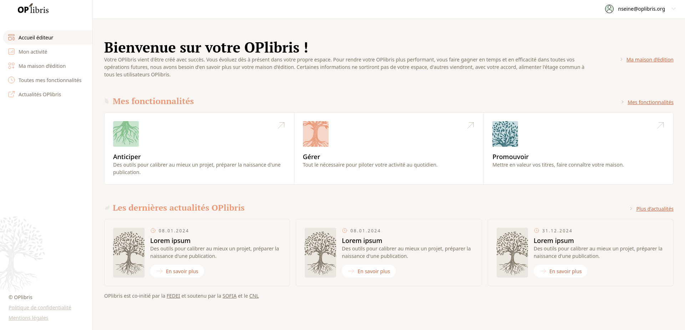

```
Difficulté générale de vocabulaire :
- Qu'est-ce qui constitute l'accueil OPlibris ?
- Quest-ce qui constitue l'espace éditeur ?C'est le bon nom ?
- Comment nommer les menus ?
- Comment appeler les différents types de pages (OPlibris beige et blanc, menu blanc à gauche... Coeur d'OPlibris avec menu vert)
```

## L'accueil d'OPlibris

En vous connectant à OPlibris, vous arriverez `probablement : est-ce que c'est l'arrivée par défaut ? Perso j'arrive sur Mon compte... sur votre _Accueil éditeur_` sur l'une des pages générale de l'accueil d'OPlibris.
Ces pages ont pour élément commun un menu de navigation sur la gauche de la page qui permet d'accéder à l'ensemble des fonctionnalités d'OPlibris.

#### Le menu de navigation OPlibris

Ce menu de navigation général permet d'accéder aux pages principales d'OPlibris :

- **Accueil éditeur :** C'est la page d'accueil générale d'OPlibris, présentant les différents blocs de fonctions et les actualités du projet
- **Mon activité :** Un tableau de bord de votre activité : tâches en cours, synthèse des résultats, statistiques. C'est une page de `l'espace éditeur ???` qui en est l'un des points d'entrée possibles.
- **Ma maison d'édition :** La page **Ma maison d'édition** de l'espace éditeur, permettant de ettre à jour les informations générales sur sa maison d'édition, son fonctionnement et ses collections.
- **Toutes mes fonctionnalités:** Une page de l'accueil OPlibris
- **Mon accueil OPlibris:**

### Mon compte

### Accueil éditeur



Cette page se compose de différentes sections :

### Toutes mes fonctionnalités

#### Anticiper

#### Gérer

#### Promouvoir

## L'interface de base de Dolibarr

### La barre de navigation

## L'interface du module OPlibris

### Le menu de navigation OPlibris
