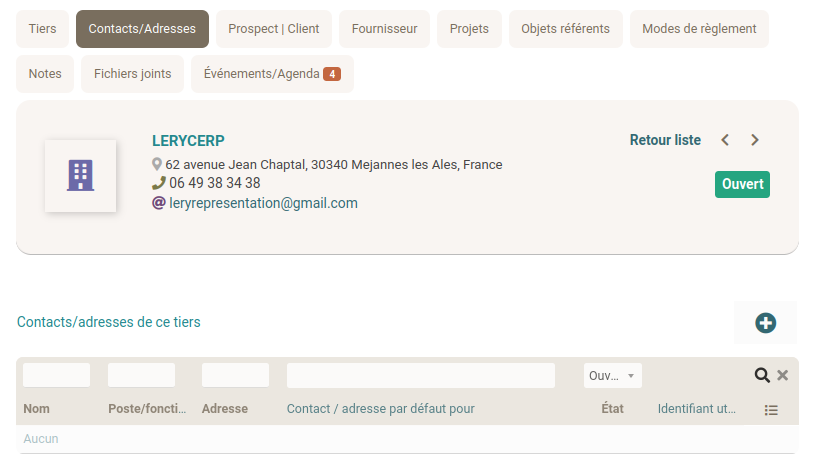

## Introduction

On appelle Tiers les partenaires avec lesquels la maison travaille.
:::caution
Les personnes payées en droits d'auteur sont des types des tiers particuliers appelés **Contributeurs** et sont traités dans une section dédiée `(==XXXX==)`
:::

Ces partenaires peuvent aussi bien être des entreprises, des associations que des particuliers.

Trois types de Tiers spécifiques ont déjà été prévus par le logiciel : **fournisseurs** (imprimeurs par exemple), **clients** (librairies, pour les maisons d'éditions auto-distribuées), `==prospects (??==)`.

Les Tiers sont donc des entités complètes (SARL, commerce, association, particulier, etc), alors que les **Contacts** représentent des personnes physiques ou un contact générique au sein du Tiers (Exemple: PDG ou ouvrier de la SARL, vendeur principal du commerce, président ou trésorier de l'association, service contentieux).

On peut créer plusieurs Contacts pour un même Tiers.

## Deux manières de créer un Contact.

- Par l'intermédiaire de l'onglet "Contacts/adresse", présent dans les fiches de chaque Tiers (Client, Fournisseur, etc).

```
==ATTENTION : pas d'onglet "Contacts/adresse" dans les fiches des contributeurs, alors que je croyais que les contributeurs étaient une sous-catégorie de tiers==
Est-ce que c'est parce que les contributeurs sont des individus, donc des contacts directement?
```



- Dans le menu du haut, cliquez sur **Tiers** →  **Nouveau Contact/Adresse**.
