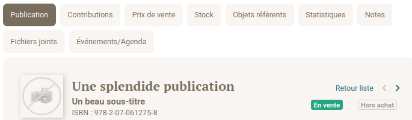
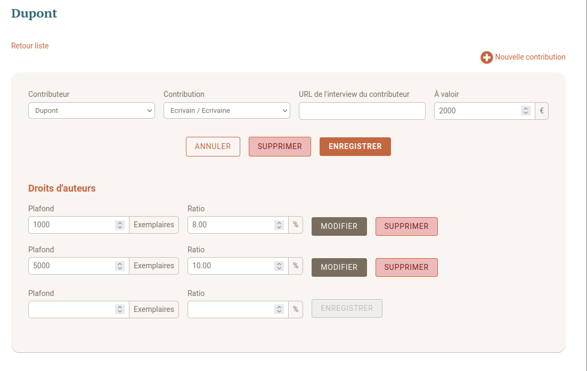
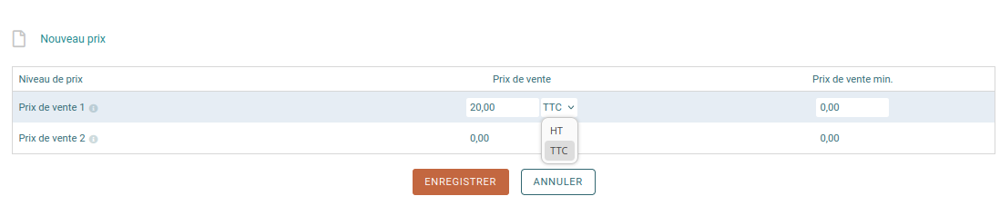

Les publications sont accessibles de deux manières :

Menu du haut → **Produits | Services → Publications → Liste**

Menu rapide → **Catalogue**

## Création manuelle

### Pour créer une nouveauté

Menu du haut → **Produits | Services** → **Publications**, cliquez sur **Nouvelle**.

Menu rapide → **catalogue** → **cliquer sur le + en haut à droite**.

Complétez les champs. Ceux marqués par un astérisque sont obligatoires.

**Libellé caisse** : si vous utilisez Op’libris pour faire des ventes directes, ce champ permet de personnaliser le nom de l’ouvrage pour vous y référer plus rapidement.

L’**URL publique** : si vous avez un site Web, ce champ renvoie à la page où vous présentez l’ouvrage.

L’**URL du feuilleteur** : si vous avez mis des extraits en ligne, complétez l’adresse de la liseuse ici.

Pour ajouter des visuels, la table des matières, des extraits, une vidéo ou des illustrations, allez sur **Mon catalogue**, puis choisissez la publication concernée. Sur l'écran suivant, cliquez dans le menu du haut sur **Fichiers joints** et ajoutez les éléments.

## Importation

### Importer depuis Dilicom

==XXXX==

### Importer depuis un diffuseur/distributeur

==XXXX==

## Détail des onglets

Quand on clique sur la publication dans le catalogue, on voit que la fiche comporte plusieurs onglets qu'il va falloir remplir.



### Onglet contribution

Cet onglet permet de connecter le livre à ses différents contributeurs, auteurs, préfaciers, mais aussi illustrateur, et tout autre intervenant rémunéré en droits d'auteur.

On ne peut entrer que les contributeurs préalablement créés
`==(sur la création des contributeurs, lire XXXX)==`

La section droits d'auteur doit être remplie avec les informations contenues dans le contrat qui lie Dupont à la ME pour l'écriture du livre.

Dans l'exemple ci-dessous, L'écrivain Dupont recevra 8% du prix TTC du livre pour les 1000 premiers exemplaire, 10 % pour les 4000 suivants.



### Onglet Prix de vente

Il faut indiquer la TVA et les prix de vente en France et hors France.

:::caution[TVA]
Attention à bien préciser TTC ou HT dans le menu déroulant, comme indiqué ci-dessous


:::

```
==Augmentation du prix du livre quelques années plus tard sans changement d'ISBN. (Pat a évoqué cette possibilité, mais je ne sais plus précisément ce qui se passe dans ce cas.)==

==Où est utilisée cette information ?==

==Dans les factures clients : Si la maison d'édition fait de la vente directe.==`
```

### Onglet Stock

Pour les ME avec un diffuseur/distributeur : ou bien on rentre les ventes à la main.

`==Quelle connexion avec le distributeur ?==
`

### Onglet Objets référents

On trouve ici les devis et les factures liés à la publication.

`==PROBLEME : plusieurs item ouvrent une page d'erreur (ceux où il n'y a pas d'objet référent) :==`


### Onglet Statistique

==Pas assez de données pour puvoir faire des tests intéressants.==

### Onglet Note

==Où apparaît la note publique ?==

### Onglet Fichiers joints

Dans cet onglet, vous pourrez ajouter des visuels (la une et la quatrième), la table des matières, des extraits, une vidéo ou des illustrations.

```
==Utilisation : connexion directe avec le diffuseur-distributeur ? Avec Dilicom ? Où sont utilisées ces infos ?==
```

### Onglet Événements/Agenda

```

==Juste un historique de toutes les modifs ou ça pourra être connecté à des rencontres ?==

```
