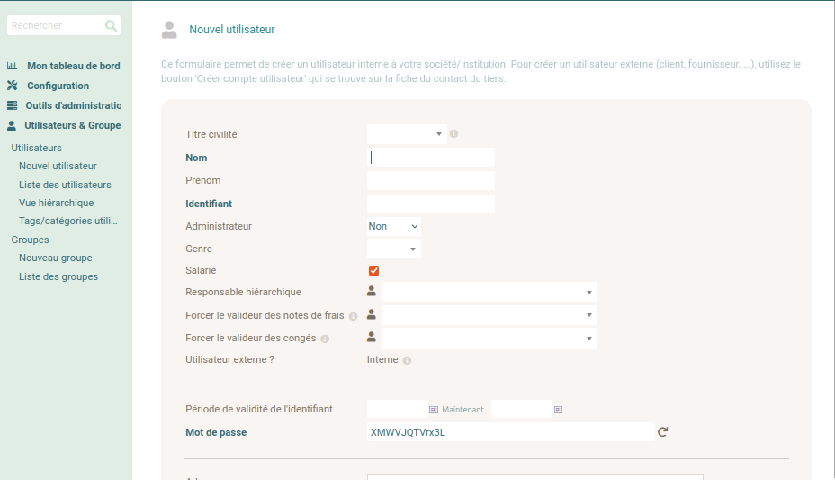
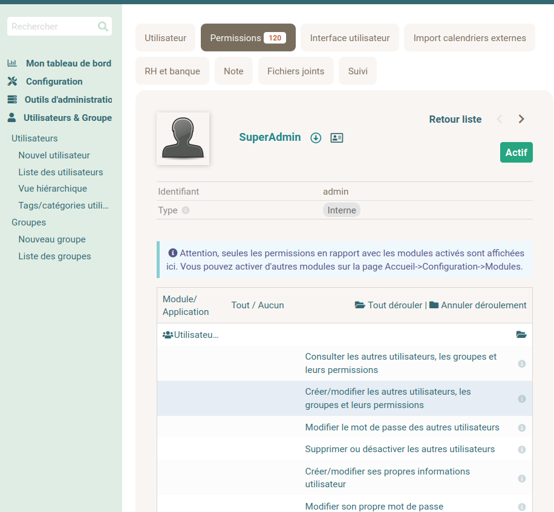
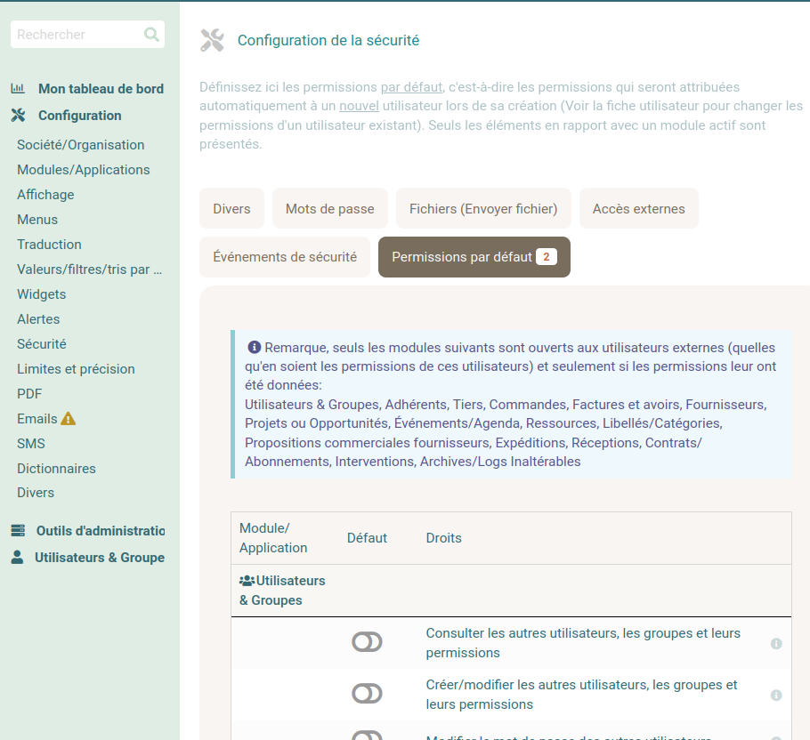

import { Tabs, TabItem } from "@astrojs/starlight/components";
import { YouTube } from "astro-embed";

==une **instance** par maison d'édition mais plusieurs **comptes** par instance. **OK pour le vocabulaire ?**==

Oplibris offre la possibilité de créer des _comptes utilisateur_ pour chacun⋅e des colaborateur⋅rices de la maison d'édition. Dans la plupart des cas il s'agit de comptes d'employé⋅es mais il peut ausi s'agir de comptes d'utilisateur externe qui aurait besoin de voir plus de données que les données en rapport avec sa société (le comptable de la maison d'édition par exemple).

Un système de permissions définit les choses auxquelles chacun⋅e a accès.

## Prérequis

Aucun réglage préalable à faire parce que le module Utilisateurs & Groupes est un module obligatoire, impossible à désactiver.

## Créer un utilisateur

Dans Réglages → Utilisateurs & Groupes → Nouvel utilisateur. Un formulaire s'ouvre :&#x20;

==COMMENTER TOUS LES ONGLETS==

==Difficulté : pas réussi à me connecter avec Identifiant/mdp → il y a besoin d'un mail.==&#x20;

<YouTube id="S5Rm9ixHNRA" />
Doc Dolibarr : [Premiers
paramétrages](https://wiki.dolibarr.org/index.php?title=Premiers_param%C3%A9trages
"Premiers paramétrages")

Si l'utilisateur a été défini comme un utilisateur externe, il ne pourra consulter que ses factures, ses commandes, et les documents qui le concerne directement, sauf si on lui donne l'autorisation de tout voir, comme pour un comptable externe.&#x20;

VIdéo complémenataire dolibarr :

<YouTube id="bs615t0aFGs" />

## Définir les permissions

==Seuls les administrateurs peuvent configurer les autorisations d'accès aux différents modules, et aux actions que ceux-ci permettent (le premier compte créé au moment de l'ouverture de l'instance a bien sûr un statut d'administrateur).==&#x20;

Pour donner les droits à un utilisateur, aller dans Réglages -> Utilisateurs & Groupes, choisissez la fiche de l'utilisateur désiré, puis cliquer sur l'onglet Permission.

La liste des droits disponibles dépendant des modules activés, il est recommandé de configurer cette partie après avoir activé les modules désirés. Attention, il faudra penser à vérifier et redéfinir les droits utilisateurs quand vous activerez à nouveau de nouveaux modules.&#x20;

Il est possible d'éviter ces étapes de configuration à faire pour chaque nouvel utilisateur en configurant les droits par défaut (comprendre droits attribués automatiquement à chaque nouvel utilisateur créé), en configurant les permissions par défaut Réglages -> Sécurité → onglet Permission par défaut :&#x20;

## L'utilisation de groupes

Il est possible d'attribuer collectivement des permissions à des utilisateurs en les associant dans des Groupes

Dans Réglages → Utilisateurs & Groupes → Nouveau groupe.&#x20;

Une fois le groupe créé, cliquez sur l'onglet Autorisation du groupe pour attribuer les permissions.

Enfin, allez dans Liste utilisateurs dans ce groupe pour ajouter des utilisateurs à ce groupe.

exemple d'utilisation :&#x20;

COnnection avec d'autres modules

module projet

module note de frais

module feuille de temps
